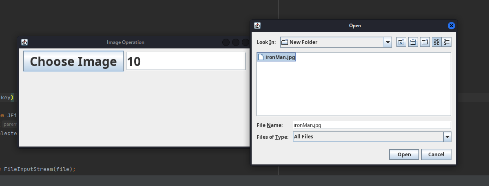

<h1 align="center">Image Encryption and Decryption</h1>
<h3 >Decryted Image</h3>

<h4 >Here, we will choose an image to make that encrypted. Before that we will pass value as passcode which will encrypt it.</h3>

